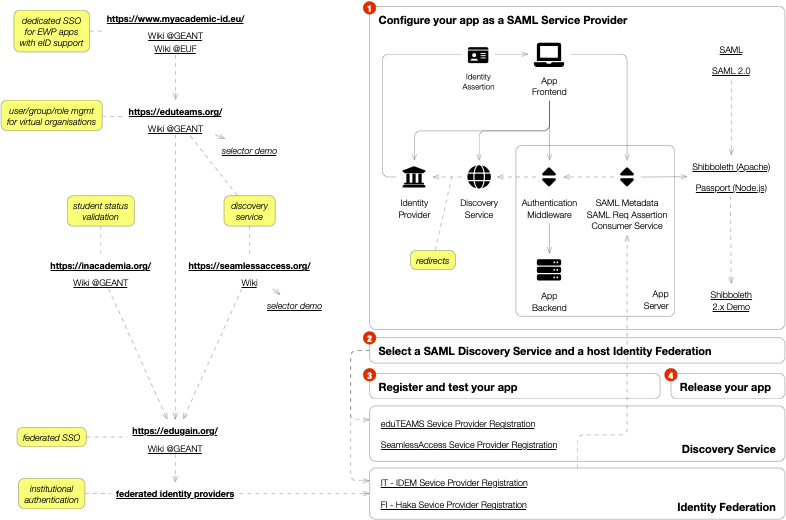

| Context | The EC2U Consortium and its partners are going to develop a range of user-facing applications requiring access to protected resources |
| --- | --- |
| Challenges | How to avoid forcing users to repeatedly register to each applications using different authentication schemes and procedures? How to avoid forcing each application to verify user academic affiliation and status before registration? |
| Solution | Authenticate users using a SAML 2.0 single sign-on protocol leveraging existing local eduGAIN Federated Identity Providers |

# Background

Access to resources secured with SAML SSO services is performed according to the following workflow:

1. an anonymous user tries to interact with a protected resource managed by the **App Backend** through an HTTP request generated by the **App Frontend** running in the user browser
2. the **Authentication Middleware** intercepts the request, recognises it as unauthenticated and redirects the user browser to a **Discovery Service**
3. the user selects a suitable **Identity Provider** among those offered by the **Discovery Service**
4. the **Discovery Service** redirects the user browser to the selected **Identity Provider**
5. the users authenticates with the selected **Identity Provider** with local credentials (usually email and password, but possibly more advance ones including redundant factors and biometry)
6. on successful authentication, the **Identity Provider** generates an **Identity Assertion** including a number of attributes detailing the user profile and returns it to the user browser
7. possibly after user confirmation, the browser submit the provided **Identity Assertion** to the **SAML Request Assertion Consumer Service** API exposed by the **Authentication Middleware**
8. the **Authentication Middleware** validates the provided **Identity Assertion** and associates its content to the user session, then redirects the user browser to the protected resource originally requested
9. the user browser generates a new HTTP request for the target resource within the current session
10. the **Authentication Middleware** intercepts the request, retrieves the **Identity Assertion** associated with the user session, extends the request with the user profile and forwards it to the **App Backend**
11. the **App Backend** authorises the request on the basis of the user profile and generates a response
12. the **Authentication Middleware** forwards the response to the **App Frontend** in the user browser

[Detailed workflows](https://www.switch.ch/aai/demo/)
and [demos](https://wayf-test.switch.ch/SWITCHaai/WAYF?entityID=https%3A%2F%2Faai-demo.switch.ch%2Fshibboleth&return=https%3A%2F%2Faai-demo.switch.ch%2FShibboleth.sso%2FLogin%3FSAMLDS%3D1%26target%3Dss%253Amem%253Ad1210ea31d576286d319e8a3ed921370b281f2b3f915fa54fb86942abe42077a)
based on the Shibbolet framework are kindly made available by [SWITCH](https://www.switch.ch/aai/).

# Procedure

## Configure the Backend

1. Wrap the **App Backend** inside an **Authentication Middleware**
2. Set up your backend code to perform user authorisation on the basis of SAML identity attributes attached by the middleware to incoming HTTP requests (retrieval technicalities are platform-specific)

> ⚠️ Due to the requirement of supporting SAML Discovery Service extension, the only currently practical approach is  to place a Shibboleth-based authentication proxy in front of the **App Backend**: see again the xecellent [SWITCH](https://www.switch.ch/aai/guides/sp/installation/) installation guides…

## Connect Identity Services

1. Select a host [eduGAIN identity federation](https://technical.edugain.org/status)
    1. this is usually the local national federation, e.g. [IDEM](https://www.idem.garr.it/index.php/en) in Italy or [HAKA](https://wiki.eduuni.fi/display/CSCHAKA/Federation) in Finland
2. Select a discovery service to be integrated into the app frontend
    1. most national identity federations provide a local discovery service (e.g. [IDEM](https://wayf.idem.garr.it/WAYF) or [HAKA](https://haka.funet.fi/shibboleth/WAYF))
    2. a global user-friendly eduGAIN discovery service is provided by the [SeamlessAccess](https://seamlessaccess.org/) service; multiple [integration options](https://seamlessaccess.atlassian.net/wiki/spaces/DOCUMENTAT/overview) are available with different levels of control on the user interface
    3. if the application lacks native user and group management facilities, the [eduTEAMS](https://eduteams.org/) service may be leveraged to manage a [virtual organisation](https://wiki.geant.org/display/eduTEAMS/Documentation) through an identity proxy that includes a global user-friendly eduGAIN [discovery service](https://ds.eduteams.org/ds/?entityID=https%3A%2F%2Fproxy.eduteams.org%2Fmetadata%2Fbackend.xml&return=https%3A%2F%2Fproxy.eduteams.org%2Fsaml2sp%2Fdisco)
3. Collect identity federation and discovery service metadata
4. Define required metadata describing the application
5. Configure the selected **Authentication Middleware** to expose metadata through the dedicated SAML Metadata API on the app server

## Configure the Frontend

1. Integrate the selected **Discovery Service** with the **App Frontend** following the specific instructions provided by the service manager

## Service Registration

1. Register the application with the selected host identity federation following the specific procedure (
   e.g. [IDEM](https://www.idem.garr.it/partecipare/registra-un-servizio)
   or [HAKA](https://wiki.eduuni.fi/display/CSCHAKA/Joining+and+registrations)); keep handy the service metadata or the
   URL of the SAML API Metadata API
2. Register the application with the selected discovery service following the specific procedure (
   e.g. [SeamlessAccess](https://airtable.com/shrW1gq06nMazByEt)
   or [eduTEAMS](https://wiki.geant.org/display/eduTEAMS/Registering+services+on+the+eduTEAMS+Service)); having
   previously completed the registration process with the host identity federation will streamline the registration
   process with the discovery service

## Service Release

1. Once registration requests are accepted, test the application on the development network where it will be initially admitted
2. Once tests are successfully completed, ask the identity federation and the discovery service to promote the application to the production network
3. Advertise to the world ;-)