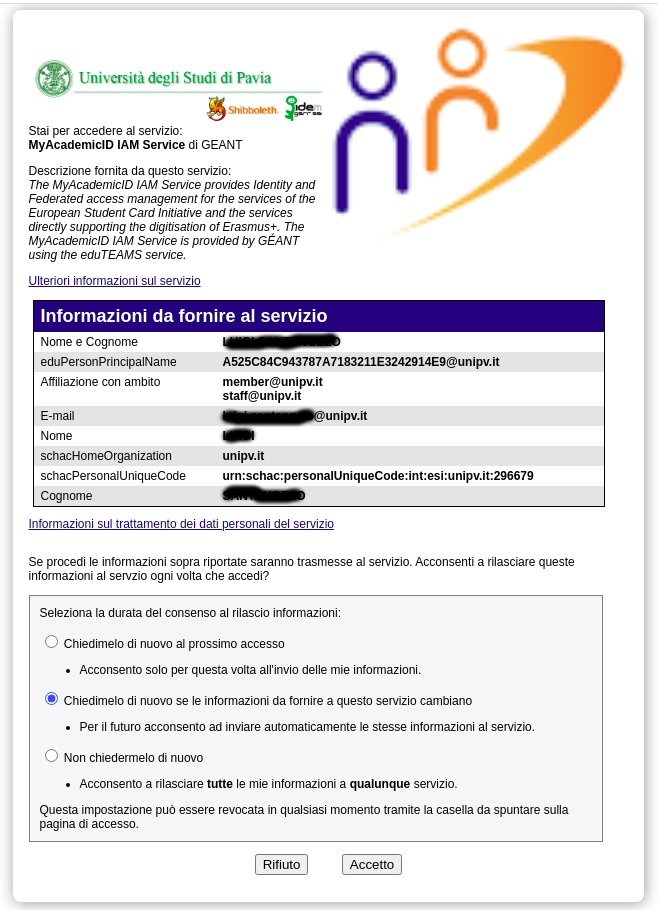

| Context | The EC2U Consortium and its partners are going to develop a range of user-facing applications requiring global, unique and neutral user identification for authorisation and recording purposes |
| --- | --- |
| Challenges | • How to avoid relying on service-specific identifiers to be reconciled on a case-by-case basis when performing cross-service activities? |
| Solution | • Identify users using a standard https://ec2u.atlassian.net/wiki/pages/resumedraft.action?draftId=11436704 systematically exposed through local Providers |

After issuing a card for a Student or Staff member, the corresponding ESI needs to be exposed though eduGAIN. In the
following will be described how such publishing can be done. Be aware that what described here can be slightly different
from what you need to do in your environment because it depends on the architecture used by each HEI for managing user
digital identities.

We will suppose that the HEI manages digital identities by using a LDAP server and the HEI is also a eduGAIN member.

# Is my HEI is an eduGAIN member?

The eduGAINs technical site [https://technical.edugain.org](https://technical.edugain.org/entities) provides many
information and tools that are useful for members. Browsing the Entity Database, indeed, it is simple to verify whether
or not your HEI is a eduGAIN member. If not, your institution needs to join eduGain project before exposing the ESI.
Administrators of service providers registered in eduGAIN interfederation can also check the service by using eduGAIN
Access Check service [https://access-check.edugain.org/](https://access-check.edugain.org/)

# Attributes required from Higher Education Institutions

To allow sharing European Student Identifier through eduGAIN, a couple of attributes need to be defined and released from
the Identity Management System of the Higher Education
Institute.  [https://wiki.geant.org/display/SM/Attributes+required+from+Higher+Education+Institutions](https://wiki.geant.org/display/SM/Attributes+required+from+Higher+Education+Institutions)
shows a list of all attributes that are required.

Mainly, two of them are really mandatory:

- `schacPersonalUniqueCode` the European Student / Staff identifier
- `schacHomeOrganization` the Home Institution from which the user is coming from (for example unipv.it)

# Extending the Digital Identity Management System

In order to manage all `schac` attributes (such as `schacPersonalUniqueCode` and `schacHomeOrganization`) required for
sharing ESI throught eduGAIN, the Digital Identity Management System used in the HEI needs to be extended with the proper
LDIF schema, named SCHAC. The original file can be download
from [https://wiki.refeds.org/display/STAN/SCHAC+Releases](https://wiki.refeds.org/display/STAN/SCHAC+Releases) , but
according to the experiences faced at University of Pavia, some little changes were required to adapt the original schema
to be used in OpenLDAP (which is the system currently used at UniPV for managing digital identities). The modified schema
is provided below. The schema defines 9 different Object Classes (`schacPersonalCharacteristics`, `schacContactLocation`
, `schacEmployeeInfo`, `schacLinkageIdentifiers`, `schacEntryMetadata`, `schacEntryConfidentiality`
, `schacUserEntitlements`, `schacGroupMembership`, `schacExperimentalOC`)  and 21 Attributes Types (two of them
are `schacPersonalUniqueCode` and  `schacHomeOrganization`).

After loading the file into the Digital Identity Management System managed by the HEI, all those entries representing
people (students and staff members) involved in a mobility process need to be extended according to the following two
rules:

- the entry needs to implement the Object Classes `SchacLinkageIdentifiers` and `schacContactLocation`
- the entry needs to define `schacPersonalUniqueCode` and `schacHomeOrganization` attributes

# Accessing MyAcademicID services

After sharing attributes through eduGAIN, all MyAcademicID services will be able to get the ESI without any further
changes. Indeed, making an access to [https://phdhub.eu/](https://phdhub.eu/) , which is one of the services provided by
MyAcademicID network, all information about the student identifier is retrieved.
]]

# The SCHAC LDIF File for OpenLDAP

```java
#
        dn:cn=schema
        #
        #objectIdentifier:TERENA1.3.6.1.4.1.25178
        #objectIdentifier:schac TERENA:1
        #objectIdentifier:schacExperimental schac:0
#objectIdentifier: schacObjectClass schac:1
#objectIdentifier: schacAttributeType schac:2
#objectIdentifier: schacExpObjClass schacExperimental:1
#objectIdentifier: schacExpAttr schacExperimental:2
#
attributeTypes :
   ( 1.3.6.1.4.1.25178.1.2.1
  	NAME 'schacMotherTongue'
  	DESC 'RFC 3066 code for prefered language of communication'
  	EQUALITY caseExactMatch
  	SINGLE-VALUE
  	SYNTAX 1.3.6.1.4.1.1466.115.121.1.15
   )
#
attributeTypes :
   ( 1.3.6.1.4.1.25178.1.2.2
  	NAME 'schacGender'
  	DESC 'Representation of human sex (see ISO 5218)'
  	EQUALITY integerMatch
  	SINGLE-VALUE
  	SYNTAX 1.3.6.1.4.1.1466.115.121.1.27
   )
#
attributeTypes :
   ( 1.3.6.1.4.1.25178.1.2.3
 	NAME 'schacDateOfBirth'
 	DESC 'Date of birth (format YYYYMMDD, only numeric chars)'
 	EQUALITY numericStringMatch
 	ORDERING numericStringOrderingMatch
 	SUBSTR numericStringSubstringsMatch
 	SINGLE-VALUE
 	SYNTAX 1.3.6.1.4.1.1466.115.121.1.36
   )
#
attributeTypes :
   ( 1.3.6.1.4.1.25178.1.2.4
  	NAME 'schacPlaceOfBirth'
  	DESC 'Birth place of a person'
  	EQUALITY caseIgnoreMatch
  	ORDERING caseIgnoreOrderingMatch
  	SUBSTR caseIgnoreSubstringsMatch
  	SINGLE-VALUE
  	SYNTAX 1.3.6.1.4.1.1466.115.121.1.15
   )
#
attributeTypes :
   ( 1.3.6.1.4.1.25178.1.2.5
  	NAME 'schacCountryOfCitizenship'
  	DESC 'Country of citizenship of a person. Format two-letter acronym according to ISO 3166'
  	EQUALITY caseIgnoreMatch
  	SYNTAX 1.3.6.1.4.1.1466.115.121.1.15
   )
#
attributeTypes :
   ( 1.3.6.1.4.1.25178.1.2.6
 	NAME 'schacSn1'
 	DESC 'First surname of a person'
 	EQUALITY caseIgnoreMatch
 	ORDERING caseIgnoreOrderingMatch
 	SUBSTR caseIgnoreSubstringsMatch
 	SYNTAX 1.3.6.1.4.1.1466.115.121.1.15
   )
##
attributeTypes :
  ( 1.3.6.1.4.1.25178.1.2.7
  NAME 'schacSn2'
  DESC 'Second surname of a person'
  EQUALITY caseIgnoreMatch
  ORDERING caseIgnoreOrderingMatch
  SUBSTR caseIgnoreSubstringsMatch
  SYNTAX 1.3.6.1.4.1.1466.115.121.1.15
  )
##
attributeTypes :
  ( 1.3.6.1.4.1.25178.1.2.8
  NAME 'schacPersonalTitle'
  DESC 'RFC1274: personal title'
  EQUALITY caseIgnoreMatch
  SUBSTR caseIgnoreSubstringsMatch
  SINGLE-VALUE
  SYNTAX  1.3.6.1.4.1.1466.115.121.1.15
  )
##
attributeTypes :
  ( 1.3.6.1.4.1.25178.1.2.9
  NAME 'schacHomeOrganization'
  DESC 'Domain name of the home organization'
  EQUALITY caseIgnoreMatch
  SUBSTR caseIgnoreSubstringsMatch
  SINGLE-VALUE
  SYNTAX 1.3.6.1.4.1.1466.115.121.1.15
  )
##
attributeTypes :
  ( 1.3.6.1.4.1.25178.1.2.10
  NAME 'schacHomeOrganizationType'
  DESC 'Type of the home organization'
  EQUALITY caseIgnoreMatch
  SYNTAX 1.3.6.1.4.1.1466.115.121.1.15
  )
#
attributeTypes :
  ( 1.3.6.1.4.1.25178.1.2.11
  NAME 'schacCountryOfResidence'
  DESC 'Country of residence of a person. Format two-letter acronym
   according to ISO 3166'
  EQUALITY caseIgnoreMatch
  SYNTAX 1.3.6.1.4.1.1466.115.121.1.15
  )
##
attributeTypes :
  ( 1.3.6.1.4.1.25178.1.2.12
  NAME 'schacUserPresenceID'
  DESC 'Used to store a set of values related to the network presence'
  EQUALITY caseExactMatch
  SUBSTR caseExactSubstringsMatch
  SYNTAX 1.3.6.1.4.1.1466.115.121.1.15
  )
##
attributeTypes: ( 1.3.6.1.4.1.25178.1.2.13
  NAME 'schacPersonalPosition'
  DESC 'Position inside an institution'
  EQUALITY caseIgnoreMatch
  SUBSTR caseIgnoreSubstringsMatch
  SYNTAX 1.3.6.1.4.1.1466.115.121.1.15
  )
##
attributeTypes: ( 1.3.6.1.4.1.25178.1.2.14
  NAME 'schacPersonalUniqueCode'
  DESC 'unique code for the subject'
  EQUALITY caseIgnoreMatch
  ORDERING caseIgnoreOrderingMatch
  SUBSTR caseIgnoreSubstringsMatch
  SYNTAX 1.3.6.1.4.1.1466.115.121.1.15
  )
##
attributeTypes :
  ( 1.3.6.1.4.1.25178.1.2.15
  NAME 'schacPersonalUniqueID'
  DESC 'Unique identifier for the subject'
  EQUALITY caseExactMatch
  ORDERING caseExactOrderingMatch
  SUBSTR caseExactSubstringsMatch
  SYNTAX 1.3.6.1.4.1.1466.115.121.1.15
  )
##
attributeTypes:
  ( 1.3.6.1.4.1.25178.1.2.17
  NAME 'schacExpiryDate'
  DESC 'Date from which the set of data is to be considered invalid (format
   YYYYMMDDhhmmssZ)'
  EQUALITY generalizedTimeMatch
  ORDERING generalizedTimeOrderingMatch
  SINGLE-VALUE
  SYNTAX 1.3.6.1.4.1.1466.115.121.1.24
  )
##
attributeTypes :
  ( 1.3.6.1.4.1.25178.1.2.18
  NAME 'schacUserPrivateAttribute'
  DESC 'Set of denied access attributes'
  EQUALITY caseIgnoreIA5Match
  SUBSTR caseIgnoreIA5SubstringsMatch
  SYNTAX 1.3.6.1.4.1.1466.115.121.1.26
  )
##
attributeTypes :
  ( 1.3.6.1.4.1.25178.1.2.19
  NAME 'schacUserStatus'
  DESC 'Used to store a set of status of a person as user of services'
  EQUALITY caseIgnoreMatch
  SUBSTR caseIgnoreSubstringsMatch
  SYNTAX 1.3.6.1.4.1.1466.115.121.1.15
  )
##
attributeTypes :
  ( 1.3.6.1.4.1.25178.1.2.20
  NAME 'schacProjectMembership'
  DESC 'Name of the project'
  EQUALITY caseIgnoreMatch
  SUBSTR caseIgnoreSubstringsMatch
  SYNTAX 1.3.6.1.4.1.1466.115.121.1.15
  )
##
attributeTypes :
  ( 1.3.6.1.4.1.25178.1.2.21
  NAME 'schacProjectSpecificRole'
  DESC 'Used to store a set of roles of a person inside a project'
  EQUALITY caseIgnoreMatch
  SUBSTR caseIgnoreSubstringsMatch
  SYNTAX 1.3.6.1.4.1.1466.115.121.1.15
  )
##
attributeTypes :
  ( 1.3.6.1.4.1.25178.1.0.2.3
  NAME 'schacYearOfBirth'
  DESC 'Year of birth (format YYYY, only numeric chars)'
  EQUALITY numericStringMatch
  ORDERING numericStringOrderingMatch
  SUBSTR numericStringSubstringsMatch
  SINGLE-VALUE
  SYNTAX 1.3.6.1.4.1.1466.115.121.1.36
  )
##
objectClasses:
  ( 1.3.6.1.4.1.25178.1.1.1
  NAME 'schacPersonalCharacteristics'
  DESC 'Personal characteristics describe the individual person represented
   by the entry'
  AUXILIARY
  MAY (
  schacMotherTongue $ schacGender $ schacDateOfBirth $ schacPlaceOfBirth $
  schacCountryOfCitizenship $ schacSn1 $ schacSn2 $ schacPersonalTitle )
  )
##
objectClasses:
  ( 1.3.6.1.4.1.25178.1.1.2
  NAME 'schacContactLocation'
  DESC 'Primary means of locating and contacting potential collaborators and
   other persons-of-interest at peer institutions'
  AUXILIARY
  MAY (
  schacHomeOrganization $ schacHomeOrganizationType $
  schacCountryOfResidence $ schacUserPresenceID )
  )
##
objectClasses:
  ( 1.3.6.1.4.1.25178.1.1.3
  NAME 'schacEmployeeInfo'
  DESC 'Employee information includes attributes that have relevance to the
   employee role, such as position, office hours, and job title'
  AUXILIARY
  MAY (
  schacPersonalPosition )
  )
##
objectClasses :
  ( 1.3.6.1.4.1.25178.1.1.4
  NAME 'schacLinkageIdentifiers'
  DESC 'Used to link a directory entry with records in external data stores
   or other directory entries'
  AUXILIARY
  MAY (
  schacPersonalUniqueCode $ schacPersonalUniqueID )
  )
##
objectClasses :
  ( 1.3.6.1.4.1.25178.1.1.5
  NAME 'schacEntryMetadata'
  DESC 'Used to contain information about the entry itself, often its
   status, birth, and death'
  AUXILIARY
  MAY (
  schacExpiryDate )
  )
##
objectClasses:
  ( 1.3.6.1.4.1.25178.1.1.6
  NAME 'schacEntryConfidentiality'
  DESC 'Used to indicate whether an entry is visible publicly, visible only
   to affiliates of the institution, or not visible at all'
  AUXILIARY
  MAY (
  schacUserPrivateAttribute )
  )
##
objectClasses :
  ( 1.3.6.1.4.1.25178.1.1.7
  NAME 'schacUserEntitlements'
  DESC 'Authorization for services'
  AUXILIARY
  MAY (
  schacUserStatus )
  )
##
objectClasses :
  ( 1.3.6.1.4.1.25178.1.1.8
  NAME 'schacGroupMembership'
  DESC 'Groups used to provide/restrict authorization to entries and
   attributes'
  AUXILIARY
  MAY (
  schacProjectMembership $ schacProjectSpecificRole )
  )
##
objectClasses:
  ( 1.3.6.1.4.1.25178.1.0.1.1
  NAME 'schacExperimentalOC'
  DESC 'Experimental Object Class'
  AUXILIARY
  MAY (
  schacYearOfBirth)
  )
##
```