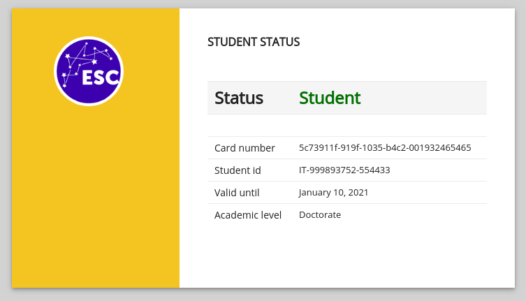

Services: https://www.notion.so/ESC-e03a89680b1646e399b71e79fc2d0430

In order to compute card validation, HEIs need to emit ESC and store European Student Card Number and European 
Student Identifier into the Centralized Registry.  A description about how HEIs can interact with the Centralized 
Registry and store student and card data on it is done on [Interact with the ESC Router](../interact-with-the-esc-router.md)

As described in [ESI](???), both students and cards are uniquely identified by an identifier (the European Student 
Indentifier and the European Student Card Number). The latter is used to verify card validity. To make this operation available for everybody, the Centralized Registry exposes a little information about the student and the card. This information can be got by getting an access to the service [http://esc.gg/](http://esc.gg/) followed by the European Student Card Number. So, for example the link

```
http://esc.gg/aec54890-72b1-1039-8e5f-001999893752
```

provides information about the card having `aec54890-72b1-1039-8e5f-001999893752` as number. The following is just an example about what it is possible to get inquiring for the specific card. As shown, no personal or sensible information are provided but just the information about the student status and the card validity.



The link shown above is that one represented by the QRCode.

For the sandbox environment, the link is slightly different:

```
http://pp.esc.gg/aec54890-72b1-1039-8e5f-001999893752
```